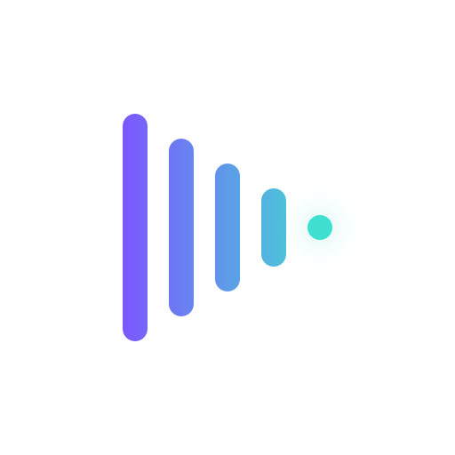

#  NoxtanPlayer
A media player for Android based on [mpv-android](https://github.com/mpv-android/mpv-android) aiming to provide a *nicer* user interface over the original.

## Additional features
- Nicer player UI
- Better playback history implementation
- Easier customization
- Sleep timer, Speed presets
- Smoother PiP

## Showcase

   
 
 

## Installation
You can download the app from the [Github releases page](https://github.com/Noven0TT0/Noxtan-Player/releases).

*Official store distributions are coming soon.*

You can also access nightly builds from [here](https://github.com/Noven0TT0/Noxtan-Player/actions/workflows/nightlies.yml)

## Acknowledgments
- [mpv-android](https://github.com/mpv-android) for the base mpv library to use for this project.
- [NoxtanPlayer (mpvKt)](https://github.com/abdallahmehiz/NoxtanPlayer) by abdallahmehiz, which this project is based on. Special thanks to the original author.